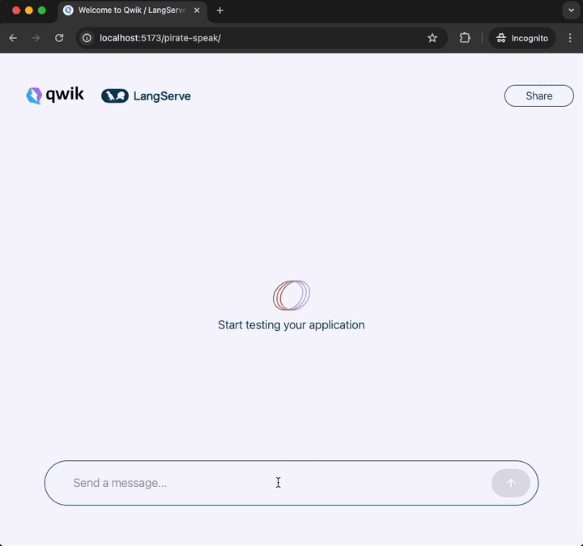

# Qwik ⚡️LangServe Playground

This repo contains a standalone LangServe Chat Playground frontend, written in [Qwik](https://qwik.builder.io/docs/), that utilizes generator functions for streaming from the backend LangServe [Event Source](https://developer.mozilla.org/en-US/docs/Web/API/EventSource).



- [Setup](#setup)
  - [Langserve](#langserve)
  - [Qwik Frontend](#qwik-frontend)
- [Project Structure](#project-structure)
- [Add Integrations and deployment](#add-integrations-and-deployment)
- [Development](#development)
- [Preview](#preview)
- [Production](#production)
- [Reference](#reference)

## Setup

### Langserve

- `pip install langchain-cli`
- `langchain app new my-app`
- When prompted “What package would you like to add?” type: `pirate-speak`
- It will say `1 added. Any more packages (leave blank to end)?)` and hit enter
- Then it will prompt, `Would you like to install these templates into your environment with pip? [y/N]` and type `y`
- `cd my-app/`
- Then run `poetry shell`
- edit the app/server.py and replace the `add_routes(app, NotImplemented)` with:

```py

from pirate_speak.chain import chain as pirate_speak_chain


add_routes(
    app,
    pirate_speak_chain,
    path="/pirate-speak",
    playground_type="chat",
)
```

- Now run `langchain serve` and verify you can access [http://127.0.0.1:8000/pirate-speak/playground/](http://127.0.0.1:8000/pirate-speak/playground/)

### Qwik Frontend

Next let us use Qwik.

- `git clone git@github.com:engineersamuel/qwik-langserve-playground.git`
- `cd qwik-langserve-playground`
- Run `npm i` to install dependencies
- Create a .env file and add: `LANGSERVE_BASE_URL=http://127.0.0.1:8000/pirate-speak`
- `npm run dev`
- Open your browser and go to [http://localhost:5173/](http://localhost:5173/) and type "Hello!" into the input box.

## Project Structure

This project is using Qwik with [QwikCity](https://qwik.builder.io/qwikcity/overview/). QwikCity is just an extra set of tools on top of Qwik to make it easier to build a full site, including directory-based routing, layouts, and more.

Inside your project, you'll see the following directory structure:

```text
├── public/
│   └── ...
└── src/
    ├── components/
    │   └── ...
    └── routes/
        └── ...
```

- `src/routes`: Provides the directory-based routing, which can include a hierarchy of `layout.tsx` layout files, and an `index.tsx` file as the page. Additionally, `index.ts` files are endpoints. Please see the [routing docs](https://qwik.builder.io/qwikcity/routing/overview/) for more info.

- `src/components`: Recommended directory for components.

- `public`: Any static assets, like images, can be placed in the public directory. Please see the [Vite public directory](https://vitejs.dev/guide/assets.html#the-public-directory) for more info.

## Add Integrations and deployment

Use the `npm run qwik add` command to add additional integrations. Some examples of integrations includes: Cloudflare, Netlify or Express Server, and the [Static Site Generator (SSG)](https://qwik.builder.io/qwikcity/guides/static-site-generation/).

```shell
npm run qwik add # or `yarn qwik add`
```

## Development

Development mode uses [Vite's development server](https://vitejs.dev/). The `dev` command will server-side render (SSR) the output during development.

```shell
npm start # or `yarn start`
```

> Note: during dev mode, Vite may request a significant number of `.js` files. This does not represent a Qwik production build.

## Preview

The preview command will create a production build of the client modules, a production build of `src/entry.preview.tsx`, and run a local server. The preview server is only for convenience to preview a production build locally and should not be used as a production server.

```shell
npm run preview # or `yarn preview`
```

## Production

The production build will generate client and server modules by running both client and server build commands. The build command will use Typescript to run a type check on the source code.

```shell
npm run build # or `yarn build`
```

## Reference

- [Qwik Docs](https://qwik.builder.io/)
- [Discord](https://qwik.builder.io/chat)
- [Qwik GitHub](https://github.com/BuilderIO/qwik)
- [@QwikDev](https://twitter.com/QwikDev)
- [Vite](https://vitejs.dev/)
